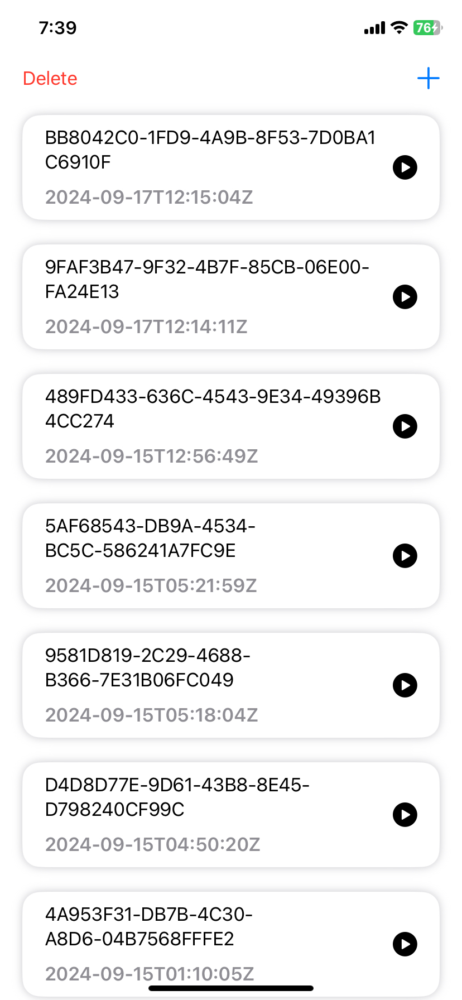
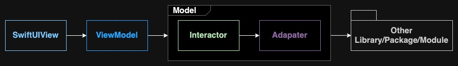
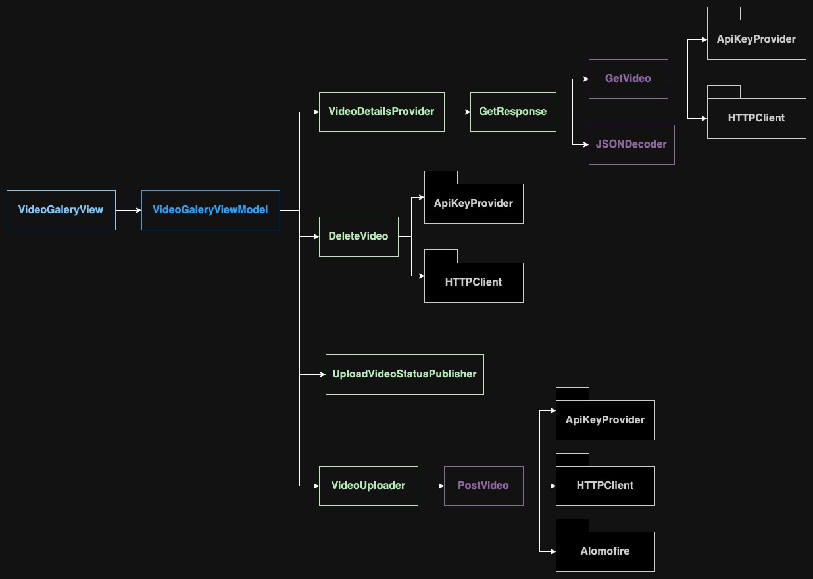
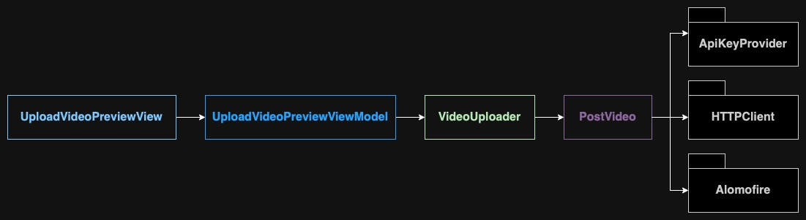
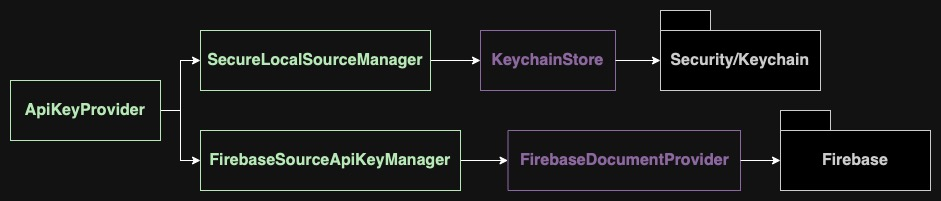
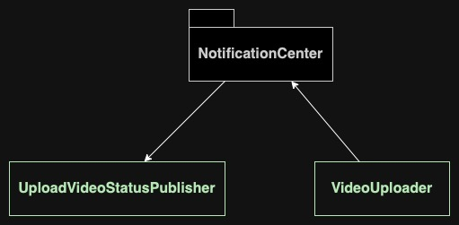

# Contents
* [Overview](#Overview): Features, Architecture, and Assumptions
* [More About Architectures](#More-About-Architectures)
* [More About User Defined Packages and Systems](#More-About-User-Defined-Packages-and-Systems)

# Overview
## Features
All views are supporting light and dark mode.
<table>
  <tr>
    <th>Show List of Uploaded Videos</th>
    <th>Retry Load Uploaded Videos</th>
  </tr>
  <tr>
    <td></td>
    <td>
    <video width="332" controls>
    <source src="README_Assets/720RetryLoadUploadedVideos.mp4" type="video/mp4">
    Your browser does not support the video tag.
    </video>
    </td>
  </tr>

  <tr>
    <th>Upload Video</th>
    <th>Retry Upload Video</th>
  </tr>
  <tr>
    <td>
    <video width="332" controls>
    <source src="README_Assets/720UploadVideo.mp4" type="video/mp4">
    Your browser does not support the video tag.
    </video>
    </td>
    <td>
    <video width="332" controls>
    <source src="README_Assets/720RetryUploadVideo.mp4" type="video/mp4">
    Your browser does not support the video tag.
    </video>
    </td>
  </tr>

  <tr>
    <th>Delete Video</th>
    <th>Delete Last Recorded Uploading Video To Record New One</th>
  </tr>
  <tr>
    <td>
    <video width="332" controls>
    <source src="README_Assets/720DeleteVideo.mp4" type="video/mp4">
    Your browser does not support the video tag.
    </video>
    </td>
    <td>
    <video width="332" controls>
    <source src="README_Assets/720DeleteLastAndUploadNewVideo.mp4" type="video/mp4">
    Your browser does not support the video tag.
    </video>
    </td>
  </tr>
</table>

## Architecture


***Higher Level Modules depend on Lower Level Modules through dependency injections of protocol or function***

* **SwiftUIView:** Presentation layer. (Exception to the rule above) Is dependent on its `ViewModel` concrete object (since a `ViewModel` belongs to a single View).
* **ViewModel:** Represent its presentation layer states and logic.
* **Interactor:** It can interact with another `Interactor` or `Adapter`. Responsibilites included are usually to transform raw data provided by `Adapter` layer into a ready to use data.
* **Adapter:** Interacts with other parties, making network request, etc.
* **Other Libary/Package/Module:** This can be user-defined, 3rd party, or Apple-built in.
 
See [More About Architectures](#More-About-Architectures) or [More About User Defined Packages and Systems](#More-About-User-Defined-Packages-and-Systems) for more implementation details

## Assumptions
* **Concept:** As a Galery App, it can be nice if there is some kind of visual representation of the videos when user is viewing and selecting the video for a preview. However, since image preview is not provided by the API, `public_id` and `created_at` are the representation of the videos information. Although generating image previews from the video might be achievable, with the limited time and also to load all the videos upfront can be inefficient, the other solution might be wiser.
* **Safe API Credentials Store:** `api_key` and `api_secret` are supposedly a secret information that should not be exposed in the codebase. So to prevent that, [ApiKeyProvider](#ApiKeyProvider) package is built for that concern.
* **1 Video Upload at a time:** The app is now only supporting for uploading a video at a time considering limited time since it can add a lot more complications to handle multiple video uploading system. To upload a new video, the user needs to cancel and delete previous unfinished uploading video if any.

# More About Architectures
## `VideoGaleryView`


**Navigates to:**
* `VideoPreviewView`
* `VideoRecordingView`: [open details](#VideoRecordingView)

**More About:**
* [ApiKeyProvider](#ApiKeyProvider)
* [HTTPClient](#HTTPClient)

## VideoRecordingView
Wrapping `CameraViewController` through `UIViewControllerRepresentable`. Use `AVCaptureSession` to connect to device's camera and enable video recording.

**Navigates to:**
* `UploadVideoPreviewView`: [open details](#UploadVideoPreviewView)

## UploadVideoPreviewView


*Upload Request using Alomofire*

**More About:**
* [ApiKeyProvider](#ApiKeyProvider)
* [HTTPClient](#HTTPClient)

# More About User Defined Packages and Systems
## `ApiKeyProvider`
Safe mechanism to retrieve Authentication information:
* `api_key` and `api_secret` are stored in Firebase (this is not necessarily the best practice of storing credential information, but only to perform safe retrieving secret information that shouldn't be exposed in the codebase).
* It will only get the secret keys from remote(Firebase) once if it hasn't been stored in keychain. After that, it will be stored in safe local storage(Keychain) and the secret keys will be retrieved from safe local storage only.



## `HTTPClient`
Consist of:
* `HTTPRequest`: using `URLSession.shared` to make simple request (is used for `GET` and `DELETE` request in this project).
* `APIURLRequest`: to build the `URLRequest`.
* `CloudinaryURLBuilder`: to construct `URL` for `api.cloudinary.com` endpoints.

## Video Uploading System


* `VideoUploader`: 
    * Make upload request
    * Retry upload request
    * Cancel upload request
    * Remove video file when necessary
    * Notify video uploading status through `NotificationCenter`
* `UploadVideoStatusPublisher`
    * Observe `NotificationCenter` to publish `UploadVideoStatus`
    ```
    enum UploadVideoStatus {
        case none
        case uploading
        case success
        case failed
    } 
    ```